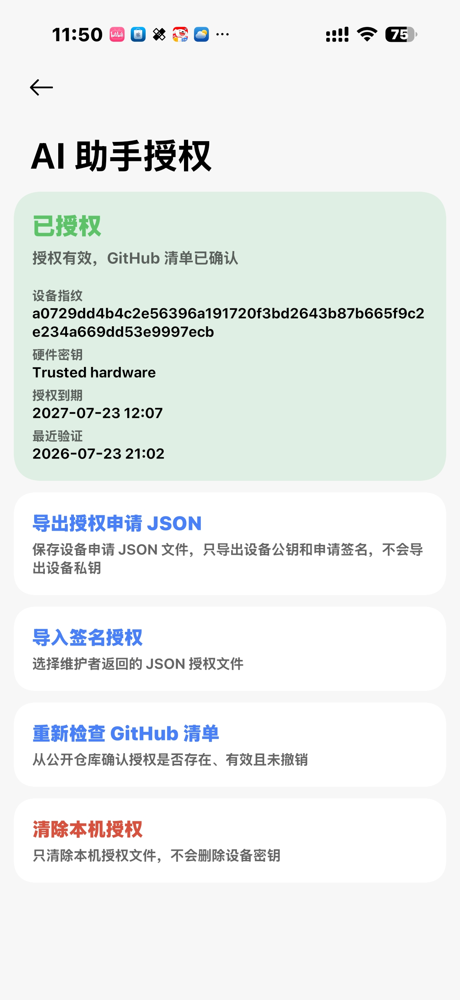
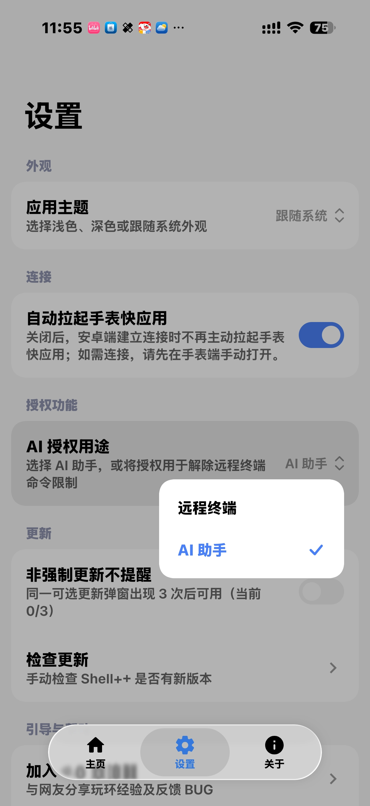

## 授权前准备

Shell++ 的 AI 相关功能需要先在 Android 应用中完成授权。开始前，请确认设备已经连接，并使用与当前版本匹配的授权配置。

## 获取授权

1. 打开 Android 应用的设置页面，连续点击五次“上分”渐变卡片，进入 AI 授权管理。

   <InvertImage></InvertImage>

2. 导出授权文件。
3. 进入 QQ 交流群，向管理员“@安卓端问题找我”私信您的米坛地址、曾经参与的项目，以及其他能够佐证您具备风险承担能力的资料。
4. 获取授权码后，向 `Shellpp@foxmail.com` 发送邮件。邮件标题填写刚获得的授权码，并附上第 2 步导出的授权文件。
5. 通常约一分钟后会收到回信。下载邮件中已签发的授权文件，返回 Shell++ 导入，即可使用 AI 助手及高级功能。

   <InvertImage></InvertImage>

不要在文档、截图或公开日志中分享授权码或授权文件。若授权失效，请撤销旧授权后重新获取。
