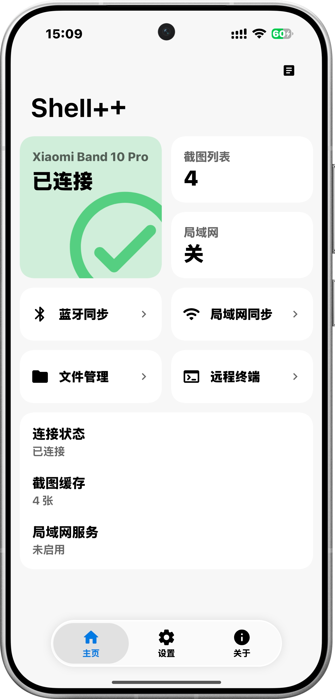
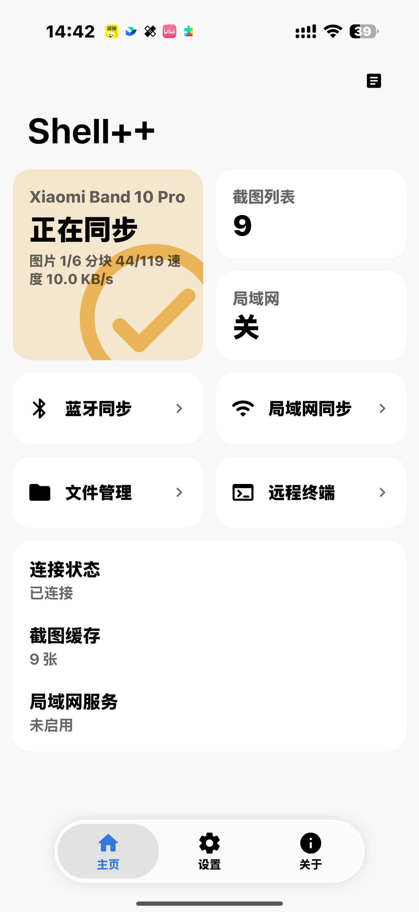

Shell++ Android 通过 Xiaomi Wearable 消息通道发现设备、发送握手并保持连接。开始前，请先完成手环端 Quick App 与 Lua 表盘的安装，确保环境已就绪，传输过程中，请始终保持手环与小米运动健康连接。

## 准备工作

- Android 8.0 或更高版本。
- 已安装当前版本的 Shell++ Android APK。
- 手环已与小米运动健康配对并处于连接状态。
- Shell++ Quick App 已在手环上打开。

## 建立连接

1. 打开 Shell++ Android。<InvertImage></InvertImage>
2. 在首页确认应用能够发现当前手环。
3. 保持手环端 Shell++ 在前台，发起连接或重新连接。
4. 等待握手完成，首页连接状态变为已连接。

连接建立后，应用会使用保活机制维护状态。手环离线、Quick App 被系统结束或消息通道失效时，状态会重新变为未连接。

## 验证连接

进入截图同步页面并刷新截图列表。即使设备上暂时没有截图，只要请求能够正常完成且没有握手错误，就说明基础通信已经建立。随后可以在手环端生成一张截图进行完整验证。

同步过程中可以退出页面探索其他页面<InvertImage></InvertImage>

## 权限与后台限制

Android 端在保存截图、发送通知或使用相关系统能力时，可能请求权限。请按照应用内提示授权。
如果系统限制应用后台运行，长时间同步可能被中断；出现这种情况时，让应用保持前台并重试。

下一步：[截图与同步](/docs/screenshots-and-sync)。
