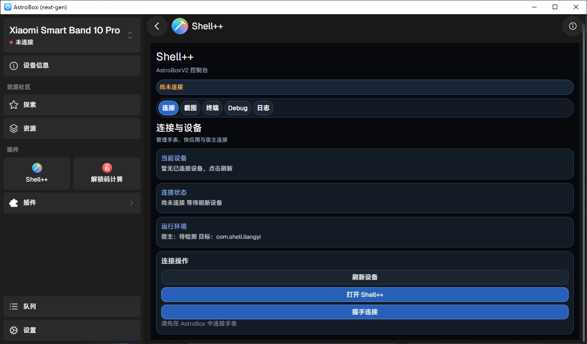

Shell++ AstroBoxV2 插件面向桌面调试和跨平台维护场景。插件会读取 AstroBoxV2 已连接设备，
注册 Interconnect 接收能力，并向手环端发送握手消息。

## 准备工作

- 已安装并能正常运行的 AstroBoxV2。
- 目标 Vela 设备已在 AstroBoxV2 中连接。
- 已下载 Shell++ `.abp` 插件包。
- Shell++ Quick App 与 Lua 资源已安装在手环端。

## 安装与连接

1. 在 AstroBoxV2 中导入 Shell++ 插件包。
2. 打开插件，并允许它使用设备、Interconnect 和接收注册等必要能力。
3. 刷新设备列表，确认目标设备出现在插件中。
4. 在手环上打开 Shell++ Quick App。
5. 在插件中发起握手。

握手成功后，插件的连接状态会更新。此时可以切换到截图、终端、调试或日志面板。

## 插件所需能力

插件清单包含设备访问、Interconnect、注册接收、第三方应用和 Deeplink 等权限。缺少
`interconnect` 或 `register_interconnect_recv` 时，插件可能能看到设备，却无法收到手环回复。

下一步：[截图与同步](/docs/screenshots-and-sync)。
