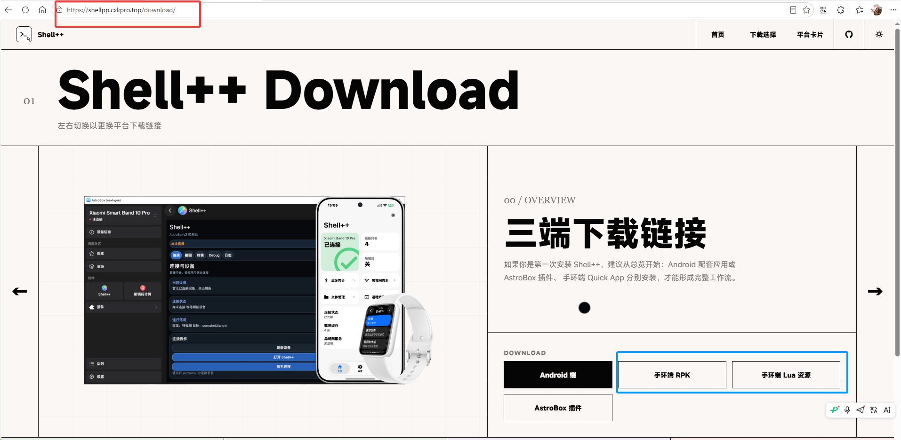
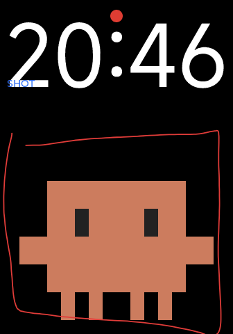

手环端由两个部分组成：提供界面的 Quick App RPK，以及执行设备任务的 Lua 资源。两者都
安装完成后，才能使用截图、终端、文件和状态功能。

## 下载安装包

前往 [Shell++ 下载页面](https://shellpp.cxkpro.top/download/) 或
[最新 GitHub Release](https://github.com/Shellplusplus/Shellplusplus/releases/latest)，获取：

- 手环端 RPK。
- 手环端 Lua 资源。
- 计划使用的 Android APK 或 AstroBoxV2 插件。

建议从同一个 Release 下载全部组件，不要把旧版 Lua 资源与新版 RPK 混用。

## 安装 Quick App

使用表盘自定义工具或

[Astrobox]: https://astrobox.online/

，将 Shell++ RPK 安装到手环或手表。

## 安装 Lua 表盘

使用表盘自定义工具或

[Astrobox]: https://astrobox.online/

，将下载的 Shell++ Lua 表盘安装。

## 安装后您需要做的三件事

1. 打开 Shell++快应用，往下滑找到并点击“设备与性能”
2. 退出应用，返回表盘，点击Claude小人
3. 点击start
4. 此时服务环境就已配置完毕

如果界面正常但始终无法执行任务，优先重新检查 Lua 资源是否部署成功，以及 RPK 与 Lua
是否来自同一版本。若仍无法工作，请查看

[常见连接问题]: https://shellplusplus.github.io/Shellplusplus-docs/docs/common-connection-issues/

下一步：连接 [Android 配套应用](/docs/connect-android) 或
[AstroBoxV2 插件](/docs/connect-astrobox)。
