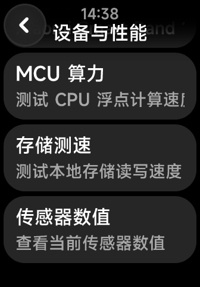

## 功能说明

设备性能测试用于快速了解当前设备的运行性能。测试前，请确保 Shell++ Quick App 与 Lua 后端均已正常启动。

## 使用方法

1. 打开 Shell++ Quick App。
2. 进入“设备与性能”。
3. 按照页面提示启动测试并等待结果生成。

<InvertImage></InvertImage>

如果某一步失败，记录失败步骤、设备型号、接收端版本和日志，再前往[常见连接问题](/docs/common-connection-issues/)排查。
