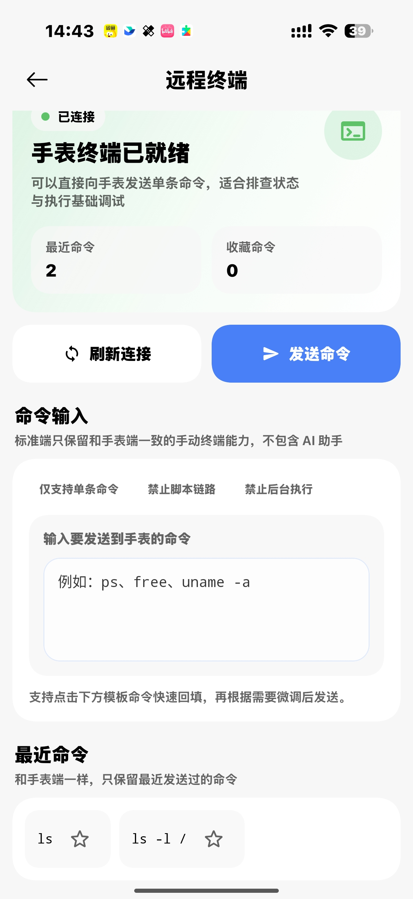

远程终端会把命令发送到手环端，由 Lua 后端执行，再将标准输出、标准错误和退出状态返回接收端。
它适合查看设备状态和辅助调试，不应当用于执行来源不明的脚本。

## 执行第一条命令

先确认接收端显示已连接，再尝试只读命令：

```sh
pwd
```

也可以查看目录或系统信息：

```sh
ls
uname
```

发送后等待当前命令返回结果，再执行下一条命令。网络或设备繁忙时，结果可能延迟。

## Android 终端

Android 应用支持发送单条命令，并保留最近命令和收藏命令。命令请求会先收到确认，随后再接收实际执行结果；如果只看到确认但没有输出，请检查手环端 Lua 资源和连接日志。

<InvertImage>

</InvertImage>

## 安全提示

- 不执行不了解作用的命令。
- 不复制粘贴来源不明的终端脚本。
- 修改文件前先确认绝对路径。
- 删除、覆盖和分区相关命令具有较高风险。
- 安全拦截只能降低风险，不能保证所有危险操作都被识别。

终端没有响应时，请查看[常见连接问题](/docs/common-connection-issues)。
