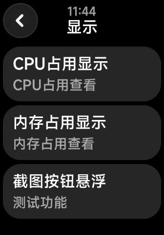

## 功能说明

悬浮显示用于在不离开当前页面的情况下查看连接状态、任务进度和最近结果。它不会替代完整的设备管理页面。

## 使用方式

1. 打开 Shell++ Quick App，进入“设备与性能”。
2. 点击“显示”，进入悬浮显示页面。

   <InvertImage></InvertImage>

3. 点击状态卡片，返回对应的功能页面。

如果悬浮入口没有出现，请检查 Lua 表盘及后端服务是否正常运行。
